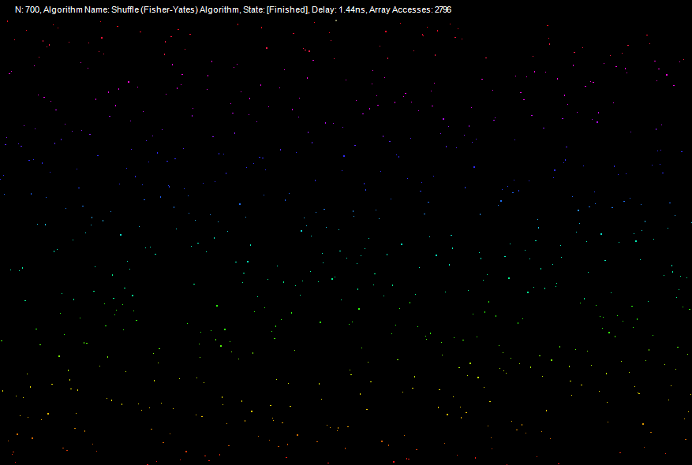
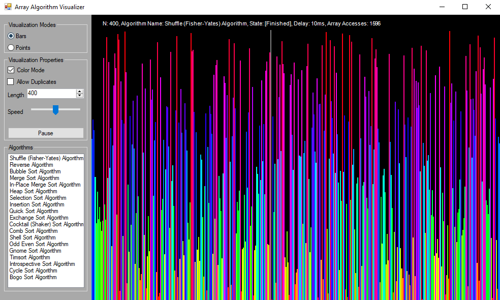
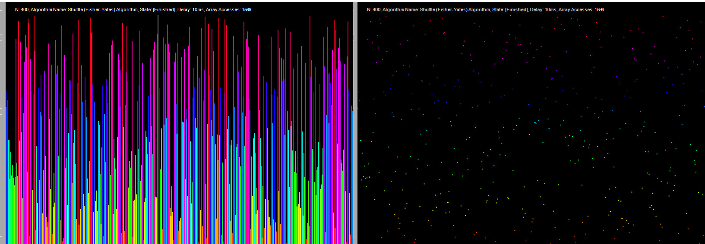

# Array Algorithm Visualizer

An array algorithm visualization program written in C#. It currently support two visualization modes and 19 algorithms.

## Demo

Array Length: 700 elements, shuffled, sorted by the Cocktail (Shaker) algorithm.



## Usage

The UI is divided into two parts the controls and the draw area, as seen below:


The control section holds 3 sections: `Visualization Mode`, `Visualization Properties` and `Algorithms`.

### Visualization Modes



Currently this visualizer supports 2 modes: `Bars` and `Points`. The modes can be cycled through with the `Ctrl-M` (keybinding see `Keybinding` section below).

### Visualization Properties

The visualization properties can be changed in the control panel, such as whether to display them with color, the length of the array, the speed of visualizaion (`Up` and `Down` keys) and pausing (which can also be done through the `Space` key).

### Algorithms

This section of the control panel contains all the currently implemented algorithms. They can be swiched at any time in the visualization process (The current algorithm doesn't have to finish).

### Keybindings

| Key           | Description                                 |
| ------------- | ------------------------------------------- |
| Space         | Pauses/Resumes the current Algorithm        |
| Ctrl-M        | Switches between the visualization modes    |
| Ctrl-S        | Shuffles the array (Fisher-Yates algorithm) |
| Up            | Decreases the delay between algorithm steps |
| Down          | Increases the delay between algorithm steps |

## Implementing a new algorithm

All agorithms inherit from the base `Algorithm` class.

```csharp
    /// <summary>
    /// This abstract class represents an argorithm, all algorithms must inherit from this class.
    /// 
    /// It implements the the IEnumerable and IEnumerator interfaces returning an Algorithm state on enumeration,
    /// which represents the steps the algorithm takes.
    /// </summary>
    public abstract class Algorithm : IEnumerable<AlgorithmState>, IEnumerator<AlgorithmState>
    {
        /// <summary>
        /// An abstract constructor of the Algorithm class.
        /// </summary>
        /// <param name="name">The name of the algorithm</param>
        /// <param name="array">The array that is manipulated</param>
        public Algorithm(string name, Array array)
        {
            this.Name = name;
            this.Array = array;
        }

        /// <summary>
        /// This methods must be override by all algorithms that inherit from this class.
        /// 
        /// It represent the actual algorithm. When you want to record the state of the algorithm,
        /// you must `yield return` the state. Which will pause the execution of the method and return.
        /// When called again it will continue where it left off.
        /// </summary>
        /// <returns></returns>
        protected abstract IEnumerator<AlgorithmState> CreateEnumerator();
    }
```

The new algorithm must override the `CreateEnumerator()` method.

```csharp
    public class MyAlgorithmAlgorithm : Algorithm
    {
        public MyAlgorithmAlgorithm(Array array) : base("My Algorithm Name", array)
        {
        }

        protected override IEnumerator<AlgorithmState> CreateEnumerator()
        {
            for (int i = 0; i <= Array.Count - 2; i++)
            {
                yield return new AlgorithmState(new List<int>() { i }); // Record step
                // ... Do some small step ...
                yield return new AlgorithmState(new List<int>() { i }); // Record step
            }

            yield break; // End algorithm.
        }
    }
```

## Quick Start

Clone the project:
```bash
git clone https://github.com/HalidOdat/ArrayVisualization.git
```
And open the `ArrayVisualization.sln` solution file in Visual Studio.
